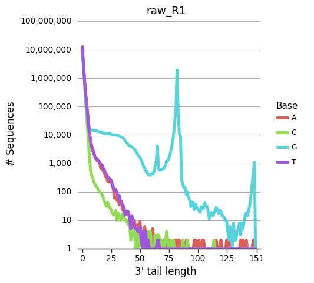
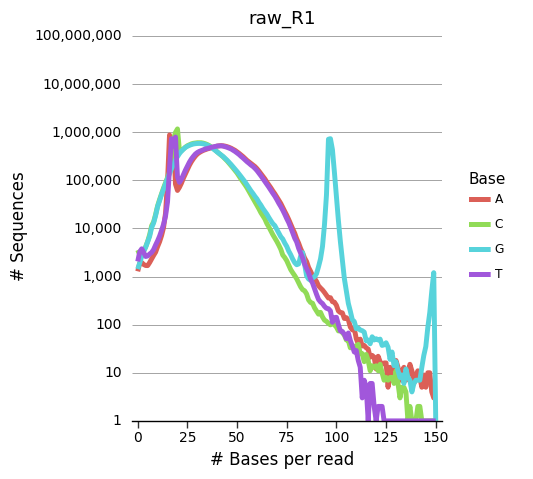
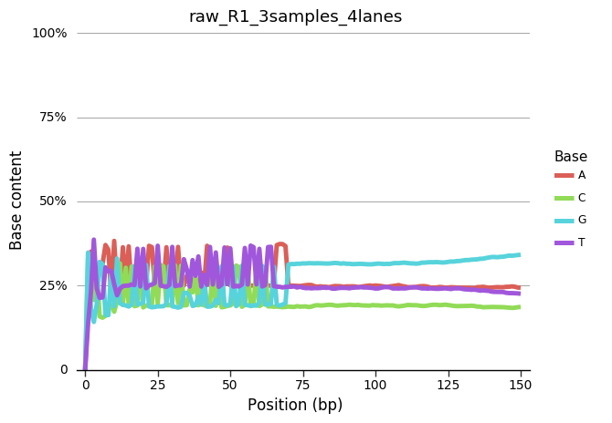

# seq_tail_analysis
Analyse base content of fastq files.
```
Usage: python seq_analyzer.py [OPTIONS]

Options:
  -i, --input TEXT   Input: Text file list of input fastq files. 1 file per
                     line.  [required]
  -o, --output TEXT  Output: Name of output tsv file.  [required]
  --help             Show this message and exit.
  ```
### Required packages
- [Bio](https://biopython.org/wiki/Download)
- [click](https://pypi.org/project/click/)
- gzip
- pandas  

## Input/Output Details
**Input**: txt file list of sequence files to analyze. One file per line.  
**Output**: Single .tsv file with stats of analyzed reads.  
**Output columns explanation:**
- position: index column that all other columns refer to
- A_tail_sequences: Number of reads with poly-A tail of length "position"
- A_total_sequences: Number of reads with "position" total As.
- A_pct_content: Portion of reads with A at "position" in the read  
- Same columns for G, T, C  

**Example row:**  

position | A_tail_sequences | A_total_sequences | A_pct_content
--- | --- | --- | ---
 40 | 200 | 6000 | 0.22

**Interpretation of example row:**  
- 200 reads had a 40bp polyA tail.
- 600 reads had a total of 40 As.
- 22% of reads had A at base position 40.

---

# Plotting results

**Plot_sequence_analysis.ipynb** Jupyter notebook is included to help visualizing results.

### Required packages
- [plotnine](https://plotnine.readthedocs.io/en/stable/installation.html)
- pandas

**Tail content plot**  
y-axis: Number of reads  
x-axis: Length of poly-N tail  
  
___
**Total base content plot**  
y-axis: Number of reads  
x-axis: Total # of N in the read  

___
**Base content by position plot**  
y-axis: % of reads  
x-axis: Base position in read  

